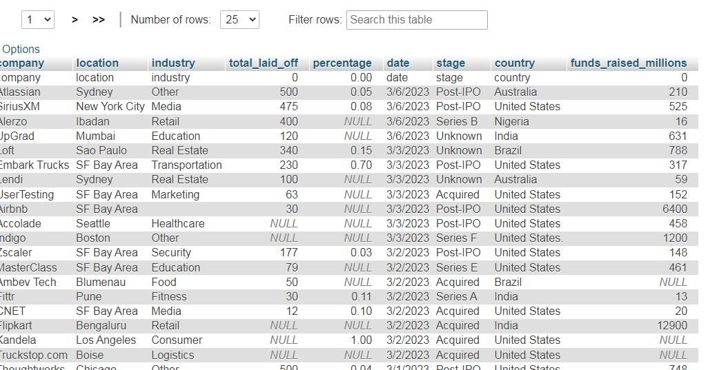
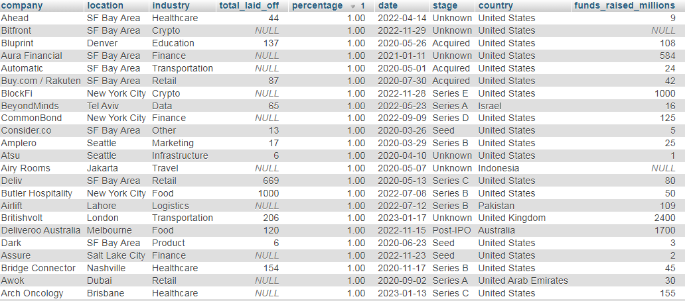
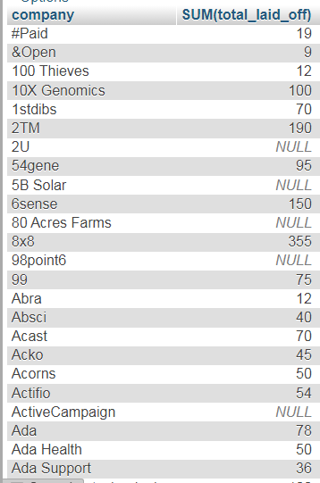
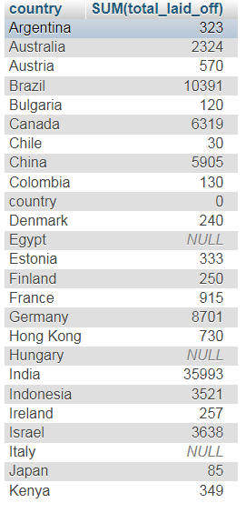
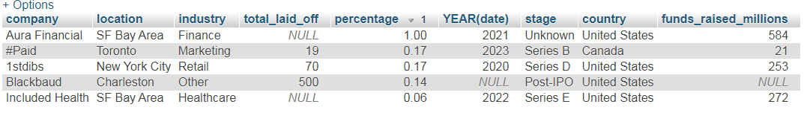

# ***QiratHussain-SQL Data Cleaning and Analysis Project: World_layoffs***
======================================================================================
## About the Project
This project focuses on transforming the raw data into clean, analysis-ready format and exploring key trends.
## DataSet
the data set contains world layoffs record including :
- Company
- Industry
- Location
- Total_laid_off
- Percentage
- Country
- Date
## Tools Used
- MySQL
- phpMyAdmin
## Raw Data
The Table below shows the raw data

## Data Cleaning steps
- inspected raw data
- removed duplicate records
- standardized the formats
- trimmed the string columns
- converted the date column from text to date format
- populated null values in industry columns
- removed rows with missing key metrics
- created a clean table for analysis

The Table below shows the cleaned data

## Exploratory Data Analysis
after cleaning, the following steps were performed:
- determined date range of layoffs
- identified top companies by comparing sum of layoffs
- identified top countries with highest layoffs
- analyzed year-wise trend of layoffs
## Insights
Here are some insights

 
